<div align="center">

# Hearthline

**AI-assisted inbox triage for property managers.**
Every resident message (email, web form, SMS, WhatsApp) is scored, routed and answered on the resident's own channel, and anything dangerous reaches a human within minutes.

[](https://github.com/KashishhKhann/Hearthline/actions/workflows/ci.yml)


[](LICENSE)

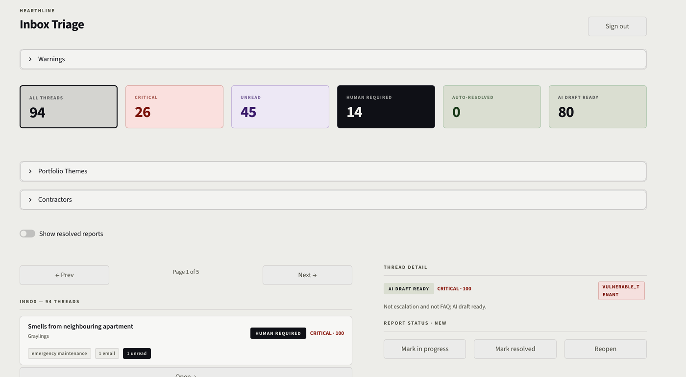

</div>

---

**Contents:** [Why](#why) · [Features](#what-it-does) · [How it works](#how-it-works) · [Triage brain](#inside-the-triage-brain) · [Critical alerts](#critical-alerts) · [Replying](#replying-to-residents) · [Contractors](#contractor-dispatch) · [Lifecycle](#conversation-lifecycle) · [Data model](#data-model) · [Quick start](#quick-start) · [Going live](#going-live) · [Testing](#testing-and-evaluation)

## Why

A property manager's inbox mixes a burst pipe, an RTB dispute, a journalist, a wifi question and a contractor invoice, all in the same list. Hearthline sorts that list so the dangerous and legally sensitive messages come first, drafts replies for the routine ones, and makes sure a critical issue at 2am wakes somebody up.

## What it does

| | |
| --- | --- |
| **Explainable triage** | Each thread gets an issue type, a 0 to 100 urgency score with a written reason for every point, sentiment, risk flags and an owner. |
| **Three handling tiers** | `human` (legal, RTB, media, welfare, repeat failures: never auto-drafted), `ai` (draft ready for review), `auto` (simple FAQ answered from a template). |
| **Every channel, one inbox** | Web form with voice dictation, SMS and WhatsApp via Twilio, and email via SendGrid Inbound Parse, all triaged by the same rules. |
| **On-call escalation** | Critical issues text the on-call manager ("Reply ACK 3F9A2C"). No ACK in 10 minutes, and the next person on the rota gets a phone call ("Press 1 to take this issue"). |
| **Approve & Send** | One click replies by SMS, WhatsApp or email, respecting consent and STOP. Delivery receipts come back from Twilio. |
| **Contractor dispatch** | Text a job to a plumber or electrician with a 4-digit code; their `YES 4821` / `DONE 4821` replies update the job. |
| **Optional LLM** | Any OpenAI-compatible model (e.g. Mistral via LM Studio) writes summaries and drafts and double-checks auto-replies. The rules still decide urgency and tier, and everything works with no model at all. |
| **Safe by default** | Twilio signature checks, rate limiting, honeypot, HTML escaping, prompt-injection fencing, login lockout, optional Twilio Verify codes, and a dry-run mode that sends nothing until you add credentials. |

<table>
<tr>
<td width="50%">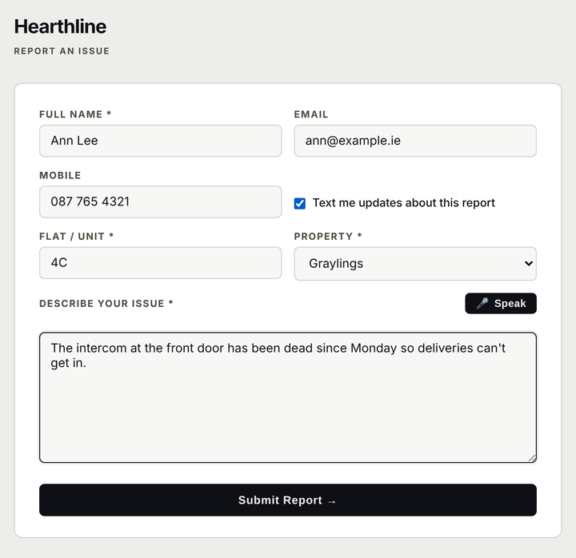</td>
<td width="50%">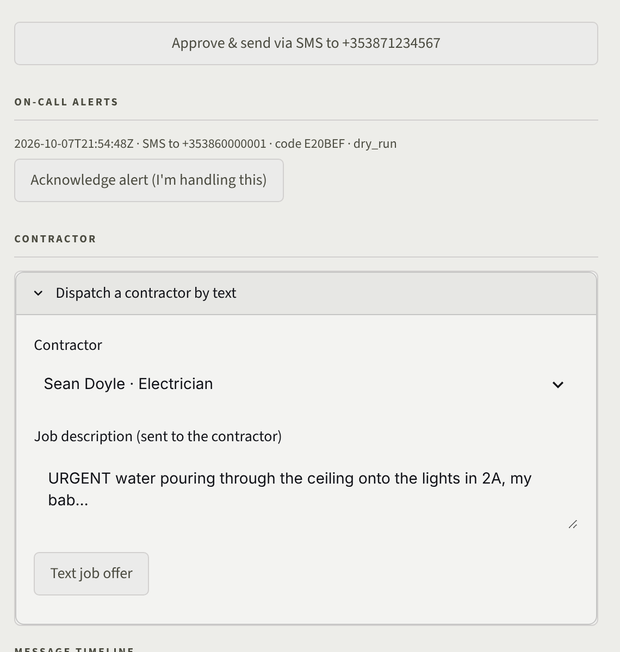</td>
</tr>
<tr>
<td align="center"><sub>Resident portal: building dropdown, SMS consent, voice dictation (en-IE)</sub></td>
<td align="center"><sub>Thread detail: Approve & Send, on-call alert, contractor dispatch</sub></td>
</tr>
</table>

## How it works

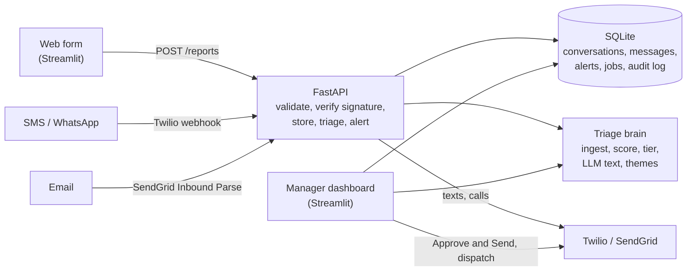

- **The API is the only door in.** Every inbound message is validated, stored and triaged the moment it arrives, so critical issues are paged without anyone opening the dashboard.
- **Everything becomes an email-shaped record**, so one set of rules handles every channel.
- **Rules decide, the LLM only writes.** Urgency and tier are deterministic and explained line by line; the model can't make a leak non-urgent.

### Life of a text message

From a resident's text to an acknowledged on-call alert, usually within seconds:

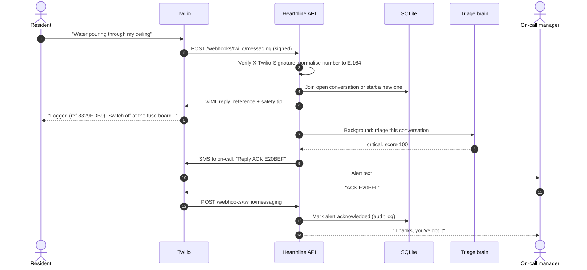

The resident's reply (step 5) goes out before triage runs, so Twilio never waits on the triage step. Web-form reports and emails take the same path from step 4 onwards.

## Inside the triage brain

Every message, whatever the channel, goes through the same pipeline:

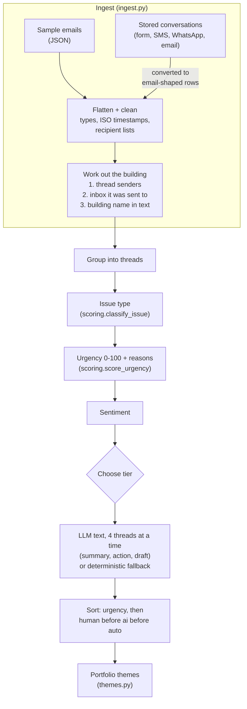

### How a thread gets its tier

Human rules are checked first; auto-replies have to clear every gate, so anything doubtful lands in the AI tier, where a person reviews the draft.

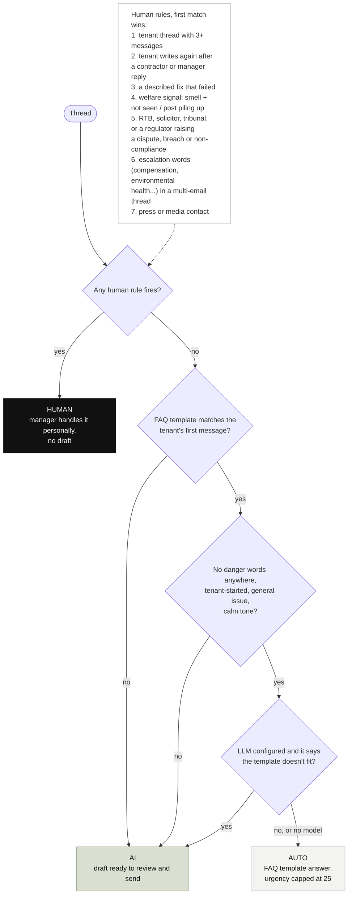

### How urgency is scored

| Signal | Points |
| --- | --- |
| Base by issue type | emergency 62, legal 56, financial 44, complaint 40 ... operational 18 |
| Welfare signal (smell + "haven't seen them") | floor of 90 |
| Emergency words (leak, flooded, smell of gas, sparking ...) | +24 |
| Legal words (RTB, solicitor, tribunal ...) | +18 |
| Repeated follow-up, contractor threat, hard deadline | +12, +14, +10 |
| Vulnerable resident (baby, elderly, pregnant) | +10 |
| Unread inbound, attachments, waiting for a reply | up to +20, +8, +12 |

80+ is critical, 60+ high, 35+ medium. Keyword matching is word-boundary aware, so "RTÉ" doesn't match "reported" and "bin" doesn't match "plumbing".

## Critical alerts

Critical issues reach a person by text immediately, and by phone if nobody answers:

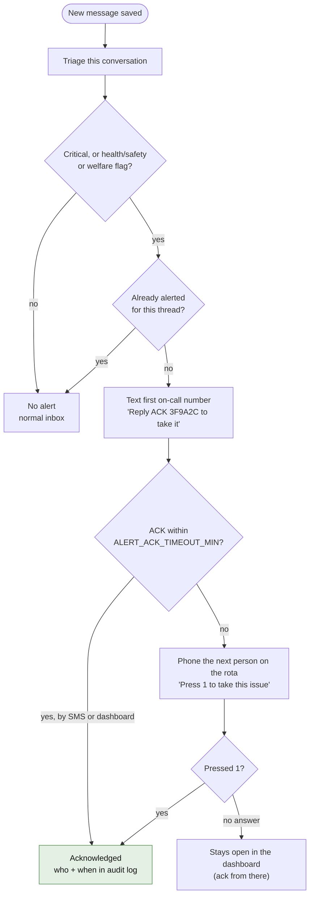

Configure the rota with `ONCALL_NUMBERS` (first number is texted first) and the timeout with `ALERT_ACK_TIMEOUT_MIN` (default 10).

## Replying to residents

**Approve & Send** works out the right channel before you click, and never texts someone who hasn't agreed to it:

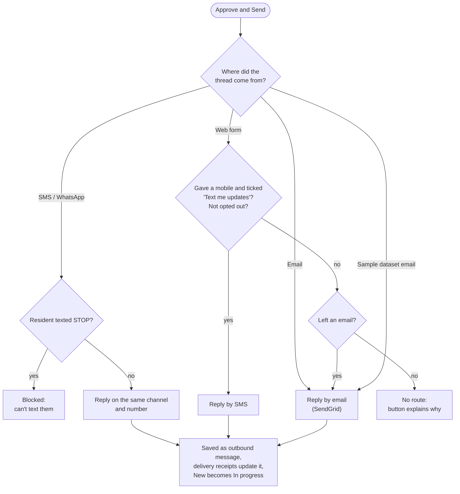

## Contractor dispatch

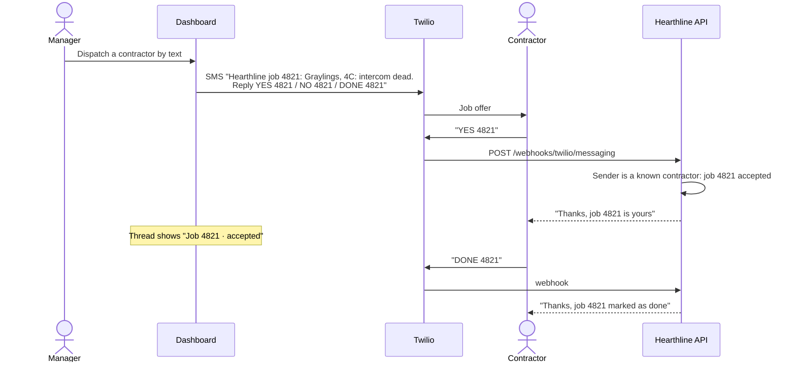

Contractor texts are recognised by their number, so they never show up as resident conversations.

## Conversation lifecycle

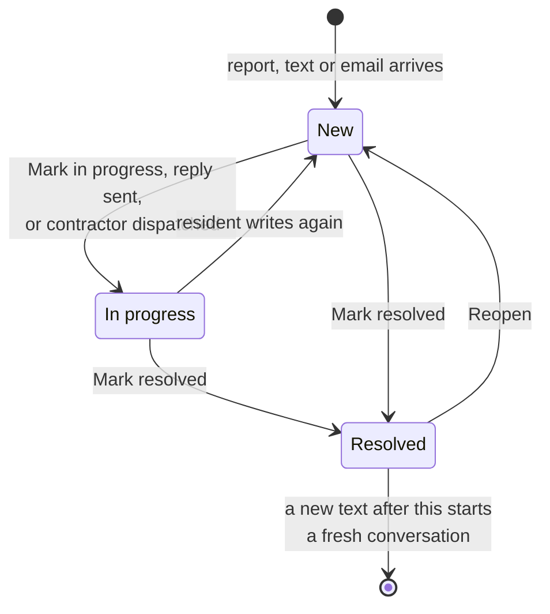

## Data model

Everything that isn't sample data lives in one SQLite file (`data/hearthline.db`) behind `store.py`:

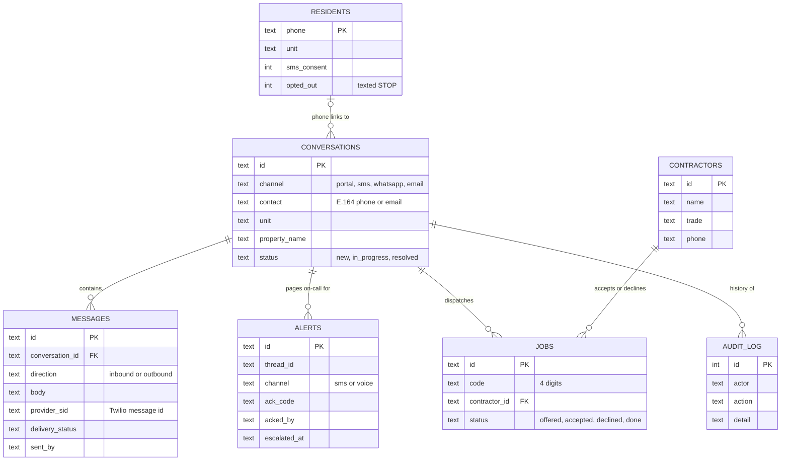

Design notes, the original code review and a changelog are in [`REVIEW_AND_ROADMAP.md`](REVIEW_AND_ROADMAP.md).

## Quick start

Runs fully offline in **dry-run mode**: no Twilio, SendGrid or LLM account needed.

```bash
git clone https://github.com/KashishhKhann/Hearthline.git && cd Hearthline
python3 -m venv .venv && source .venv/bin/activate
pip install -r requirements-dev.txt
cp .env.example .env          # set HEARTHLINE_PASSWORD
./scripts/dev.sh              # API on :8000, app on :8501
```

| URL | What |
| --- | --- |
| http://localhost:8501 | Resident portal |
| http://localhost:8501/admin | Manager dashboard |
| http://localhost:8000/docs | API docs (OpenAPI) |

Simulate a resident texting in (with `HEARTHLINE_INSECURE_WEBHOOKS=1` in `.env`, local testing only):

```bash
curl -X POST localhost:8000/webhooks/twilio/messaging \
  --data-urlencode From=+353871234567 \
  --data-urlencode "Body=Water pouring through my ceiling onto the lights"
```

Or with Docker: `docker compose up --build`.

## Going live

<details>
<summary><b>Twilio: SMS, WhatsApp, voice escalation</b></summary>

1. `ngrok http 8000` and set `HEARTHLINE_PUBLIC_URL` to the https URL.
2. In the Twilio console, set the number's (or WhatsApp sandbox's) "A message comes in" webhook to `POST {HEARTHLINE_PUBLIC_URL}/webhooks/twilio/messaging`.
3. Set `TWILIO_ACCOUNT_SID`, `TWILIO_AUTH_TOKEN`, `TWILIO_FROM_NUMBER`, `TWILIO_WHATSAPP_FROM` and `ONCALL_NUMBERS` in `.env`.

Every webhook is verified against Twilio's `X-Twilio-Signature`. STOP / START are honoured.
</details>

<details>
<summary><b>Email: SendGrid Inbound Parse</b></summary>

Set `INBOUND_EMAIL_TOKEN`, then point an Inbound Parse host (an MX record on a domain you own) at `{HEARTHLINE_PUBLIC_URL}/webhooks/sendgrid/inbound/{INBOUND_EMAIL_TOKEN}`. Replies go out through SendGrid with `SENDGRID_API_KEY` and a verified `SENDGRID_FROM_EMAIL`.
</details>

<details>
<summary><b>Login codes: Twilio Verify</b></summary>

Set `TWILIO_VERIFY_SERVICE_SID` and `HEARTHLINE_ADMIN_PHONE` and the dashboard asks for a texted code after the password.
</details>

<details>
<summary><b>LLM</b></summary>

Set `LLM_BASE_URL` to any OpenAI-compatible endpoint (e.g. `http://localhost:1234/v1` for LM Studio) and `LLM_MODEL`. One JSON call per thread, 4 in parallel, cached, with a circuit breaker if the model goes down.
</details>

All settings are documented in [`.env.example`](.env.example).

## Testing and evaluation

```bash
pytest                                            # 150 tests, ~3 seconds, no network
python -m pyflakes *.py pages/*.py backend/*.py eval/*.py tests/*.py
```

The tests cover webhooks signed with Twilio's real `RequestValidator`, the full alert → no ACK → voice call → "press 1" flow, consent-based reply routing, prompt-injection fencing and the triage rules. CI runs them on Python 3.10 and 3.12.

To measure triage accuracy against hand labels:

```bash
python eval/evaluate.py init                      # writes eval/labels.csv to fill in
python eval/evaluate.py score --compare 390e86c   # precision / recall / F1, now vs the original hackathon code
```

## Project structure

<details>
<summary>Show files</summary>

```
app.py                  resident portal (Streamlit)
pages/admin.py          manager dashboard (Streamlit, /admin)
backend/main.py         FastAPI: reports, Twilio + SendGrid webhooks, admin API, escalation loop
backend/alerting.py     single-message triage, on-call SMS, voice escalation
backend/replies.py      reply routing by channel, consent and STOP
backend/dispatch.py     contractor job offers and YES / NO / DONE replies
backend/notify.py       Twilio + SendGrid client with dry-run
backend/validation.py   input validation, E.164 phones, rate limiter
store.py                SQLite storage shared by API and dashboard
pipeline.py             triage orchestrator
ingest.py               loading, normalising, building inference
scoring.py              issue type, urgency score, sentiment
escalation.py           human-tier rules and risk flags
autoresolve.py          FAQ template matching
llm.py                  LLM client: JSON calls, injection fencing, cache, circuit breaker
themes.py               portfolio themes
eval/evaluate.py        labelling sheet and accuracy report
tests/                  pytest suite
data/                   sample dataset (100 emails, 92 threads, 5 Dublin buildings)
```
</details>

## Roadmap

- [x] Deterministic, explainable triage with optional LLM
- [x] SMS, WhatsApp, email and web intake
- [x] On-call SMS + voice escalation
- [x] Approve & Send, contractor dispatch, Verify login
- [ ] Hand-labelled evaluation results published here
- [ ] Postgres + Redis for multi-process deployments
- [ ] Per-user accounts and roles

## Background

Hearthline started as a hackathon MVP at the Give(a)Go Hiring Hackathon in Dublin (March 2026) and has since grown into a full-stack project built around Twilio's messaging and voice APIs.

Built by [Kashish Khan](https://github.com/KashishhKhann) · MIT licensed
